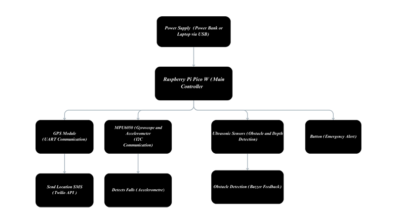
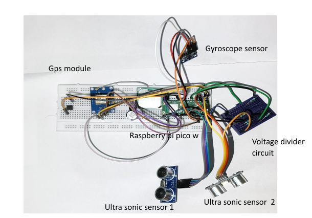
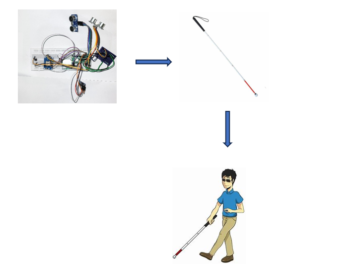
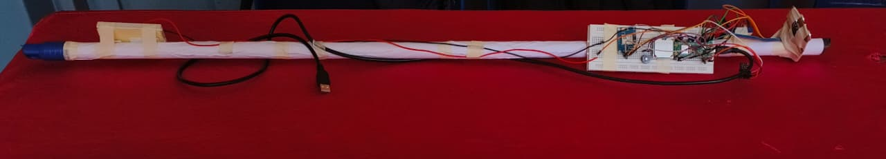

# Smart Blind Stick for Visually Impaired Individuals

## Overview
The Smart Blind Stick is an assistive device designed to help visually impaired individuals navigate safely. It integrates multiple sensors to detect obstacles, measure depth, detect falls, and send GPS location alerts to family members via SMS using Twilio. The stick provides real-time feedback through a buzzer.

## Repository Structure

| File | Description |
| :--- | :--- |
| `smart_blindstick.py` | **Core Logic:** Python script managing sensor data and Twilio integration. |
| `block_diagram.png` | Visual representation of the system architecture and connections. |
| `circuit_blind_stick.png` | Detailed circuit diagram showing pin mappings for Raspberry Pi Pico. |
| `implementation_diagram.png` | Flowchart illustrating the fall detection and alert logic. |
| `hardware.jpg` | High-resolution image of the physical prototype and sensor placement. |

---

## Components Used
* **Raspberry Pi Pico**
* **GPS Module**
* **Ultrasonic Sensors (x2)**
* **Gyroscope Sensor**
* **Buzzer**
* **Push Button**
* **Resistors** (as needed)
* **Breadboard / PCB**
* **9V Battery**

## Features
* **Obstacle Detection:** Ultrasonic sensor detects nearby obstacles and alerts the user through buzzer.
* **Depth Detection:** Another ultrasonic sensor measures the depth of drop-offs or steps.
* **Fall Detection with Delay:** Gyroscope detects if the user falls. After a **10-second delay**, the GPS module sends the user’s location to family members via Twilio SMS, giving the user a chance to cancel false alarms.
* **Manual Location Alert:** Pressing the button sends the user’s location immediately via Twilio SMS.
* **GPS Fallback via IP:** If GPS fails to provide location, the system fetches approximate location using IP-based geolocation and sends it via Twilio SMS.
* **Buzzer Alerts:** Different beep patterns indicate depth detection and obstacle detection.

## Applications
* Navigation assistance for visually impaired individuals
* Safety during walking or mobility
* Prototype for wearable assistive technology

---
**Developed by [rohanasgowda](https://github.com/rohanasgowda)**
